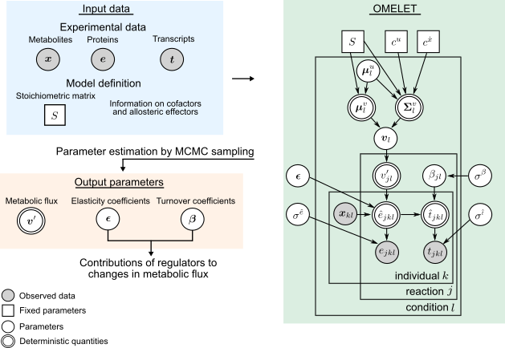

# Overview

MATLAB, R, and RStan code for omics-based metabolic flux estimation without labeling for extended trans-omic analysis (OMELET).

OMELET is an approach to use simultaneously obtained multi-omic data to infer metabolic fluxes in each condition, identify changes in metabolic flux between conditions, and quantify contributions of regulators to the changes in metabolic flux. 




## Workflow

The series of analysis performed in Uematsu et al. are described in `run_OMELETmouse.m` for mouse data and `run_OMELETyeast.m` for simulated data from the yeast kinetic model.

For the analysis of mouse data:

1. Make input data for OMELET (MATLAB).
   + `make_input_OMELET/make_input_OMELETmouse.m` 
2. Perform OMELET to infer metabolic fluxes and other parameters (RStan).
   + `OMELET_rstan/run_OMELETmouse.R`
3. Calculate contributions of regulators to changes in metabolic flux between conditions (MATLAB).
   + `prep` method in `@outputOMELETmouse` class
4. Make figures (MATLAB and R).
   + `makeFig*` methods in `@outputOMELETmouse` class.
   + Figure 4A is plotted by R in `OMELET_rstan/run_OMELETmouse.R`.


For the analysis of simulated data from the yeast kinetic model:

1. Make input data for OMELET (MATLAB).
   + `@simulateKineticModel` class
2. Perform OMELET to infer metabolic fluxes and other parameters (RStan).
   + `OMELET_rstan/run_OMELETyeast.R` 
   + Figure S3 is plotted by R in this script.

# Requirements

The developmental version of the programs has been tested on the following systems:

Ubuntu 18.04.5 LTS or Windows 10

MATLAB R2019a

SimBiology toolbox (for application of OMELET to the yeast kinetic model)

Docker version 20.10.6

# Contents

## 1. Make input data for OMELET

### make_input_OMELET

MATLAB scripts to make input data for OMELET.

+ `make_input_OMELET/make_input_OMELETmouse.m`

  This code makes input data for OMELET from `make_input_OMELET/S_OMELETmouse.csv`. The input data used in Uematsu et al. is `OMELET_rstan/input_OMELETmouse_sample`. 

+ `make_input_OMELET/S_OMELETmouse.csv`

  Stoichiometric matrix and information on cofactors and allosteric effectors. This is used in `make_input_OMELET/make_input_OMELETmouse.m`.

+ `make_input_OMELET/S_OMELETyeast.csv`

  Stoichiometric matrix and information on cofactors and allosteric effectors for simulated data. This is used in `makeRstanInput` method in `@simKineticModel` class.

### @simKineticModel

A MATLAB class to generate datasets (metabolites, enzymes, and metabolic fluxes) in several conditions from the yeast kinetic model as input data for OMELET. `makeRstanInput` method in `@simKineticModel` class loads `make_input_OMELET/S_OMELETyeast.csv`. The input data used in Uematsu et al. is `OMELET_rstan/input_OMELETyeast_sample`. 


## 2. Perform OMELET to infer metabolic fluxes and other parameters

### OMELET_rstan

Scripts to perform OMELET in RStan.

+ `OMELET_rstan/run_OMELETmouse.R`

  This code performs parameter estimation of `OMELET_rstan/OMELETmouse.stan` model. You need to prepare `OMELET_rstan/input_OMELETmouse` directory of input data, which is generated by `make_input_OMELET/make_input_OMELETmouse.m`. This script also makes Figure 4A.

+ `OMELET_rstan/run_OMELETyeast.R`

  This code performs parameter estimation of `OMELETyeast.stan` model. You need to prepare input data in `OMELET_rstan/input_OMELETyeast` directory of input data by `makeRstanInput` method in `@simKineticModel` class. This script also makes Figure S3.


The RStan environment can be build from docker images `saori/rstan` from [DockerHub](https://hub.docker.com/r/saori/rstan). Make sure you have [Docker Engine](https://docs.docker.com/engine/install/) installed. We provide two options.

+ `saori/rstan:latest`

  This docker image is used to run RStudio Server (based on `rocker/rstudio:3.6.1`). Dockerfile is provided as `docker_files_for_rstan/saori_rstan_latest/Dockerfile`. 

  To get `saori/rstan:latest`:

  ```shell
  docker pull saori/rstan:latest
  ```

  To run this image in a docker container:

  (terminal in Ubuntu)

   ```shell 
   cd OMELET_rstan
   bash run_docker_RStan.sh container_name rstudio
   ```

  (command prompt in Windows):

  ```
  cd OMELET_rstan
  run_docker_RStan.bat container_name rstudio
  ```

  

+ `saori/rstan:cmd`

  This docker image is used to run R console without running RStudio Server (based on `rocker/r-ver:3.6.1`). You can use this image to perform parameter estimation of several models in one computer. Dockerfile is provided as `docker_files_for_rstan/saori_rstan_cmd/Dockerfile`.

  To get `saori/rstan:cmd`:
  
  ```shell
  docker pull saori/rstan:cmd
  ```
  
  To run this image in a docker container:
  
  (terminal in Ubuntu)
  
  ```shell
  cd OMELET_rstan
  bash run_docker_RStan.sh container_name cmd
  ```
  
  (command prompt in Windows):
  
  ```
  cd OMELET_rstan
  run_docker_RStan.bat container_name cmd
  ```
  
  


## 3. Calculate contributions of regulators to changes in metabolic flux between conditions

### @outputOMELETmouse

A MATLAB class to make outputs of OMELET. `prep` method in this class calculates contributions of regulators to changes in metabolic flux between conditions. You need to prepare RStan input by `make_input_OMELET/make_input_OMELETmouse.m` and output by `OMELET_rstan/run_OMELETmouse.R`.


## 4. Make figures

### @outputOMELETmouse

A MATLAB class to make outputs of OMELET. `makeFig*` methods in `@outputOMELETmouse` class make figures for Uematsu et al. You need to run `prep` method beforehand.


## data

Data used for Uematsu et al.

+ `data/metabolome.csv`, `data/proteome.csv`, `data/transcriptome.csv`

  Metabolomic, proteomic, and transcriptomic data from wild-type (WT) and leptin-deficient obese (*ob*/*ob*) mice at fasting state and after oral glucose administration. These are used as input data for OMELET (`make_input_OMELET/make_input_OMELETmouse.m`) and to make figures (`@outputOMELETmouse`).

+ `data/pathway_matlab1.csv`

  A template pathway of the glucose metabolism for constructing trans-omic networks.

+ `data/BIOMD0000000503_url.xml`

  The yeast kinetic model downloaded from [BioModels](https://www.ebi.ac.uk/biomodels/BIOMD0000000503) for generating datasets (metabolites, enzymes, and metabolic fluxes) in several conditions as input data for OMELET (`@simulateKineticModel`).


Additional data not used in OMELET but for Figure S1 in Uematsu et al.

+ `data/blood_glucose.csv`, `data/blood_insulin.csv`

  Time-course data of blood glucose and insulin after oral glucose administration.


## +lib

Shared program libraries for the above scripts.


# Contact

Saori Uematsu: suematsu@bs.s.u-tokyo

Satoshi Ohno: sohno@bs.s.y-tokyo.ac.jp

Shinya Kuroda: skuroda@bs.s.u-tokyo.ac.jp

# Reference

Saori Uematsu, Satoshi Ohno, Kaori Tanaka, Atsushi Hatano, Toshiya Kokaji, Yuki Ito, Hiroyuki Kubota, Ken-ichi Hironaka, Yutaka Suzuki, Masaki Matsumoto, Keiichi I. Nakayama, Akiyoshi Hirayama, Tomoyoshi Soga, and Shinya Kuroda. Omics-based label-free metabolic flux inference reveals dysregulation of glucose metabolism in liver associated with obesity.

